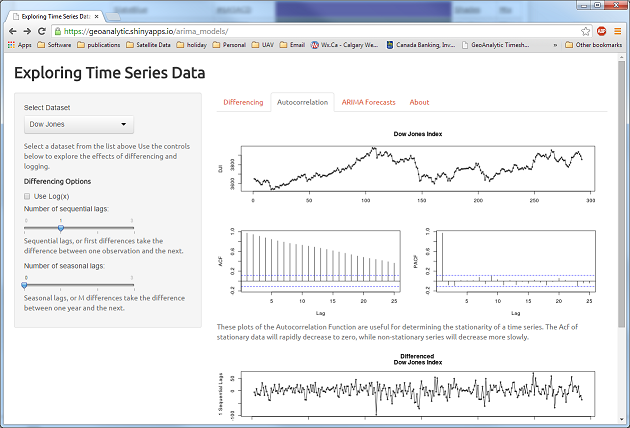

---
output:
  slidy_presentation:
    self_contained: yes
---

## Exploring Time Series Data
by David Currie, Oct 2014   
```{r firstslide, echo=FALSE,fig.align='center',message=FALSE}
library(forecast)
library(fpp)
fit <- auto.arima(usmelec,seasonal=TRUE)
plot(forecast(fit), ylab="Billion kWHr", xlab="Year",main="Forecast Monthly US Electricity Generation")
```

  [This application is available as a Shiny app.](https://geoanalytic.shinyapps.io/arima_models/)

---

### Goals
Forecasting from time series data is an interesting but difficult problem.  Using examples from the text [Forecasting: principles and practice](http://otexts.org/fpp/), written by [R. Hyndman](http://robjhyndman.com/) and G. Athanasopoulos, this interactive website allows the user to explore a few key topics.  The code is based on functions provided in the `Forecast` package.   

```{r secondslide,echo=FALSE,fig.align='right'}
par(mfrow = c(2,3))
plot(dj, main = "Dow Jones", xlab = "Day")
plot(hsales, main = "Home Sales", xlab = "Year")
plot(lynx, main = "Lynx", xlab = "Year")
plot(beer, main = "Beer", xlab = "Year")
plot(elec, main = "Aus Electricity", xlab = "Year")
plot(a10, main = "Prescriptions", xlab = "Year")
par(mfrow=c(1,1))
```


---

### Stationarity and Differencing   
Time series data can contain linear and cyclic trends, in addition to random signals, that make modelling difficult. Removing these effects prior to analysis allows the underlying signal to be observed. Pre-processing of the time series can be done using logs and sequential differencing.   

```{r thirdslide,echo=FALSE,fig.align='center'}
eeadj <- seasadj(stl(elecequip, s.window="periodic"))
tsdisplay(diff(eeadj), main="Seasonally adjusted new orders index")
```

---

### ARIMA Models   
**A**uto**R**egressive **I**ntegrated **M**oving **A**verage models estimate the autocorrelations within the data in order to account for trends and cycles.  Very effective forecasts may be computed from such a model.   
```{r fourthslide, echo=FALSE,fig.align='center'}
fit <- auto.arima(beer,seasonal=TRUE)
plot(forecast(fit), ylab="Megaliters", xlab="Year",main="Forecast Monthly Australian Beer Production")
```

---

### Data Exploration  
The [arima-models](https://geoanalytic.shinyapps.io/arima_models/) website permits the exploration and forecasting from 10 sample datasets.    




